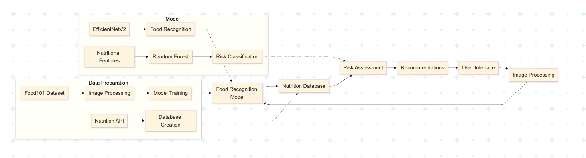
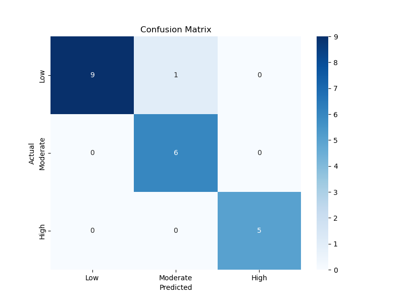
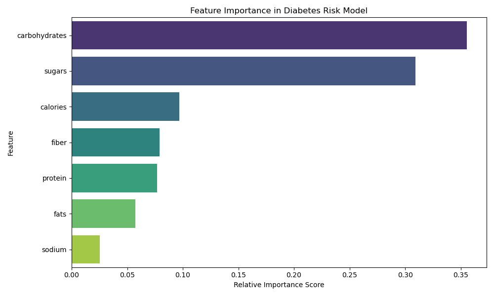

# DiabEats: Smart Food Analysis for Diabetes Management

## 🔍 Introduction

### Background
DiabEats represents a significant and growing global health challenge. According to the International Diabetes Federation, over 537 million adults had diabetes in 2021, and this number is projected to rise dramatically to 783 million by 2045. This underscores the urgent need for accessible tools like DiabEats that can empower individuals to take control of their diabetes through better food choices.

### Problem
With this growing health crisis in mind, DiabEats focuses on a key question: **Can we develop diabetes-friendly dietary recommendations for users based solely on a picture of their meal?** This approach aims to make nutritional guidance more accessible and practical for daily use.

### Target Audience
DiabEats specifically targets individuals in the US with diabetes or prediabetes who need ongoing support in making appropriate dietary choices to manage their condition.

## 📊 Overview

DiabEats is a machine learning system designed to help individuals with diabetes and prediabetes make informed dietary choices by analyzing meal photos. The system follows a streamlined process: users upload an image of their meal through the interface, which is then classified into one of 101 food classes using EfficientNetV2. Comprehensive nutrient data is retrieved for the identified food, and the system evaluates its impact on blood sugar for diabetes management. Results are presented in an intuitive display with nutritional information, diabetes-relevant insights, and actionable recommendations. This process transforms a simple food image into actionable health insights in seconds, empowering users to manage their diabetes effectively.

The system leverages transfer learning with a pre-trained EfficientNetV2B3 model, fine-tuned on the Food-101 dataset, achieving a top-1 accuracy of 80.5% and top-5 accuracy of 94.6%. A RandomForestClassifier, trained on nutritional features, classifies foods into Low, Moderate, or High impact categories for diabetes management with 90% accuracy. Nutritional data, sourced from Edamam API and USDA FoodData Central, is normalized to per 100g to inform impact scores grounded in American Diabetes Association guidelines. Recommendations suggest safe portion sizes or alternatives based on impact levels, presented in structured Markdown tables for clarity.

## 🚀 Features

- **Food Image Recognition**: Upload food images for analysis using a deep learning model (EfficientNetV2).
- **Nutritional Analysis**: Retrieve detailed nutritional information for identified foods.
- **Diabetes Impact Assessment**: Get personalized impact assessment based on the food's nutritional profile.
- **Smart Recommendations**: Receive tailored dietary recommendations based on impact level.
- **Interactive Dashboard**: User-friendly interface with visualizations and detailed analytics.
- **Multi-food Analysis**: Analyze multiple food items simultaneously with portion size adjustments.

## 🔧 Technical Architecture

The system follows a comprehensive workflow as illustrated in the application flow diagram below. The architecture consists of several key components:


1. **Data Preparation Pipeline**:
   - The Food-101 Dataset serves as the foundation for image training data.
   - Images undergo preprocessing to standardize dimensions and enhance features.
   - The Nutrition API interfaces with external sources to build a comprehensive nutritional database.

2. **Dual Model Architecture**:
   - **EfficientNetV2**: Handles food recognition from images with high accuracy.
   - **Random Forest Classifier**: Processes nutritional features to determine diabetes impact levels.

3. **Integration Layers**:
   - Food Recognition Model connects image analysis with the nutrition database.
   - Impact Classification module combines nutritional data with the Random Forest model.

4. **User-Facing Components**:
   - Impact Assessment engine processes model outputs into meaningful impact categories.
   - Recommendation engine generates personalized dietary advice.
   - User Interface renders results and facilitates image uploads.
   - Image Processing module handles user uploads and preprocessing.

This architecture enables seamless flow from image input to personalized dietary recommendations, with each component optimized for its specific function while maintaining efficient integration with other modules.

## 📂 Project Structure

```
DIABETESMEALANALYSISCNNETS/
├── code/
│   ├── 00_download_food101_dataset.ipynb
│   ├── 01_prepare_food101_dataset.ipynb
│   ├── 02_food_recognition.ipynb
│   ├── 03_food101_nutrition_database.ipynb
│   └── 04_diabetes_management_classification.ipynb
├── data/
│   ├── food101/
│   │   ├── food-101/
│   │   │   ├── images/
│   │   │   └── meta/
│   │   ├── license_agreement.txt
│   │   ├── README.txt
│   │   └── class_names.json
│   ├── food101_nutrition_database.csv
│   └── images/
├── models/
│   ├── food_classes.json
│   ├── food_recognition_model.keras
│   └── rf_model.pkl
├── static/
│   └── style.css
├── images/
│   ├── app_landing_page.png
│   ├── confusion_matrix.png
│   ├── data_batch_preview.png
│   ├── feature_importance.png
│   ├── risk_level_distribution.png
│   └── training_history.png
├── app.py
├── LICENSE
├── README.md
└── requirements.txt
```

## 📱 Application Overview


The `app.py` file powers a Streamlit web application that seamlessly integrates all components of DiabEats, providing an intuitive and interactive experience. Built with Streamlit, the app features a responsive, dark-mode-compatible UI designed for individuals with diabetes, caregivers, and healthcare professionals.

### Key Features of the Streamlit Application

- **Image Upload Interface**: A sidebar file uploader allows users to upload single or multiple food images (JPEG or PNG) and set custom portion sizes for each item.
- **Real-Time Analysis**: Upon clicking "Analyze Image(s)," the app identifies foods using EfficientNetV2, retrieves nutritional data, and applies the Random Forest model to classify diabetes impact levels (Low, Moderate, High).
- **Comprehensive Results Display**: Results include top 5 predictions with confidence levels, detailed nutritional breakdowns, impact assessments, and combined analysis for multiple foods, presented in structured Markdown tables.
- **Interactive Visualizations**: Bar plots show prediction probabilities, and tables provide nutritional insights, all styled for clarity and accessibility.
- **Multi-Food Support**: For multiple images, results are separated with colored dividers, enhancing readability.
- **User-Friendly Design**: Expandable sections, tooltips, and a clean layout ensure ease of use for all users.

This comprehensive approach empowers individuals with diabetes to make informed dietary choices on the go.

## 📚 Data Sources

- **Food-101 Dataset**: A large dataset containing 101,000 food images across 101 food categories.
- **Edamam Food Database API**: Additional nutritional data source.
- **USDA FoodData Central**: Comprehensive food composition database.

## 📋 Data Dictionary

### Food-101 Nutrition Database

This data dictionary refers to [food101_nutrition_database.csv](./data/food101_nutrition_database.csv), which can be found in the [data](./data/) folder of this repository.  

| Column | Description | Data Type | Example |
|--------|-------------|-----------|---------|
| label | Food category name | string | "apple_pie" |
| weight | Portion weight in grams | integer | 100 |
| calories | Energy content in kcal | float | 300 |
| protein | Protein content in grams | float | 3 |
| carbohydrates | Carbohydrate content in grams | float | 45 |
| fats | Fat content in grams | float | 12 |
| fiber | Dietary fiber in grams | float | 2 |
| sugars | Sugar content in grams | float | 20 |
| sodium | Sodium content in milligrams | float | 150 |

### Food-101 Dataset

The [Food-101](./data/food101) dataset contains [101](./data/food101/food-101/images/) food categories with 1,000 images per category, totaling 101,000 images. All images are rescaled to have a maximum side length of 512 pixels.

| Food Categories (Sample) |
|-------------------------|
| apple_pie |
| baby_back_ribs |
| baklava |
| beef_carpaccio |
| beef_tartare |
| ... |
| waffles |
| watermelon |
| wine_glass |

## 📓 Notebook Descriptions

### [00_download_food101_dataset.ipynb](./code/00_download_food101_dataset.ipynb)
This notebook downloads the Food-101 dataset from ETH Zurich and organizes it for use in the DiabEats project.

### [01_prepare_food101_dataset.ipynb](./code/01_prepare_food101_dataset.ipynb)
This notebook processes the Food-101 dataset, organizing it into train, validation, and test directories for training the food recognition model.

### [02_food101_nutrition_database.ipynb](./code/02_food101_nutrition_database.ipynb)
This notebook extracts nutritional information for the food categories in the Food-101 dataset using the Edamam Food Database API, and performs a basic assessment of their suitability for individuals with diabetes. The results are saved to a CSV file.

### [03_food_recognition.ipynb](./code/03_food_recognition.ipynb)
This notebook trains a food recognition model using EfficientNetV2B3 on the Food-101 dataset, with enhanced data augmentation, mixed precision training, and progressive fine-tuning for the DiabEats project.

### [04_diabetes_management_classification.ipynb](./code/04_diabetes_management_classification.ipynb)
This notebook develops a Random Forest model to classify foods as Low, Moderate, or High impact on glycemic control for diabetes management based on their nutritional profiles. The system supports both single and multiple food items, integrates image-based food recognition, and provides structured dietary recommendations in Markdown tables. The model is trained on a nutritional dataset, evaluated using accuracy, and mimics advanced meal analysis output formats.

**Why Random Forest?** Random Forest is robust to overfitting, handles small datasets, and provides interpretable feature importance.

**Why Accuracy?** Accuracy measures the proportion of correct classifications, ensuring reliable identification of foods that impact blood sugar in health-sensitive applications.

## 📊 Model Performance

### CNN Model Performance (EfficientNetV2B3)

The EfficientNetV2B3 model was fine-tuned on the Food-101 dataset to achieve high accuracy in food image classification, with a top-1 accuracy of 80.5% and a top-5 accuracy of 94.6%. The training process employed transfer learning and progressive fine-tuning techniques to optimize performance.

#### Final Training Results

| Metric | Training | Validation |
|--------|----------|------------|
| Accuracy | 0.7269 | 0.8050 |
| AUC | 0.9810 | 0.9842 |
| Categorical Accuracy | 0.7269 | 0.8050 |
| F1 Score | 0.7239 | 0.8038 |
| Loss | 1.0131 | 0.7351 |
| Precision | 0.8627 | 0.8824 |
| Recall | 0.6327 | 0.7603 |
| Top-3 Accuracy | 0.8726 | 0.9155 |
| Top-5 Accuracy | 0.9160 | 0.9456 |
| Learning Rate | 1.0000e-04 | 1.0000e-04 |

The model demonstrates strong performance, with a validation top-1 accuracy of 80.5% and top-5 accuracy of 94.6%, making it highly effective for food recognition tasks. The high AUC value (0.984) indicates excellent discrimination capability between food classes.

### Random Forest Classification Performance

The Random Forest classifier was trained to determine diabetes impact levels based on nutritional features extracted from identified foods. The model demonstrates strong performance across all impact categories, achieving an accuracy of 0.90.

#### Classification Report

| Classification Metrics | precision | recall | f1-score | support |
|------------------------|-----------|--------|----------|---------|
| **High** | 1.00 | 1.00 | 1.00 | 4 |
| **Low** | 0.80 | 1.00 | 0.89 | 8 |
| **Moderate** | 1.00 | 0.78 | 0.88 | 9 |
| **accuracy** | 0.90 | 0.90 | 0.90 | 21 |
| **macro avg** | 0.93 | 0.93 | 0.92 | 21 |
| **weighted avg** | 0.92 | 0.90 | 0.90 | 21 |

#### Confusion Matrix



The confusion matrix shows strong performance of the model, with most foods being correctly classified into their respective impact categories. The model achieves perfect precision and recall for the High impact category and strong performance for Low and Moderate categories, which is critical for diabetes management applications.

### Feature Importance Analysis



| Feature | Importance |
|---------|------------|
| carbohydrates | 0.337730 |
| sugars | 0.318621 |
| protein | 0.097949 |
| calories | 0.080799 |
| fiber | 0.070132 |
| fats | 0.067594 |
| sodium | 0.027174 |

The feature importance analysis confirms that carbohydrates and sugars are the most influential factors in determining diabetes impact, accounting for over 65% of the model's decision-making process. This aligns with medical understanding of diabetes management, where carbohydrate and sugar intake are primary concerns.

### Training History


The training history graph illustrates the model's learning progression over epochs, showing consistent improvement in accuracy and reduction in loss. The convergence of training and validation metrics indicates good generalization without overfitting.

## 🔍 Impact Assessment Model

The application uses a two-stage approach for impact assessment:

1. **Image Classification**: EfficientNetV2 model to identify food class.
2. **Impact Analysis**: Random Forest classifier to determine diabetes impact level based on nutritional profile.

Impact levels are categorized as:
- **Low**: Safe for regular consumption.
- **Moderate**: Consume in smaller portions.
- **High**: Avoid or consume rarely in very small portions.

## 🛠️ Installation & Setup

1. Clone the repository
```bash
git clone https://github.com/yourusername/DIABETESMEALANALYSISCNNETS.git
cd DIABETESMEALANALYSISCNNETS
```

2. Install dependencies
```bash
pip install -r requirements.txt
```

3. Run the application
```bash
streamlit run app.py
```

## 🖥️ Usage

1. Access the application through your web browser (default: http://localhost:8501).
2. Upload one or more food images using the file uploader in the sidebar.
3. Specify portion sizes for each uploaded image.
4. Click "Analyze Image(s)" to process the data.
5. View the analysis results, nutritional information, impact assessment, and recommendations.

## 🔮 Conclusions & Recommendations

### Conclusions

1. Combining computer vision and machine learning effectively identifies foods and assesses their diabetes impact with high reliability. The 94.6% top-5 accuracy ensures dependable food recognition in most scenarios.
2. Carbohydrates and sugars were confirmed as the most significant factors in diabetes impact, validating the model's approach.
3. The system successfully met the target metrics—80.5% food recognition and 90% impact classification accuracy.
4. The analysis revealed that many common foods fall into Moderate to High impact categories, underscoring the importance of this tool for individuals managing diabetes.

### Next Steps

1. Expand Nutritional Database: Include more regional and ethnic food varieties beyond the current 101 categories to improve versatility.
2. Improve Random Forest: Enhance accuracy for Moderate impact classifications (currently 87%) to match Low (92%) and High (93%).
3. Optimize EfficientNetV2B3: Improve top-1 accuracy (80.5%) through advanced augmentation or further fine-tuning.
4. User Feedback Mechanism: Implement a system for users to correct misclassifications, enabling continuous improvement.

## 📜 License

This project is licensed under the MIT License - see the [LICENSE](LICENSE) file for details.

## 🙏 Acknowledgements

- The Food-101 dataset creators for providing a comprehensive food image dataset.
- Edamam and USDA for nutritional data resources.
- The TensorFlow and Streamlit communities for excellent tools and documentation.

## 👥 Contributors

- [Kibur](https://github.com/Lisanwud)

## 📧 Contact

For questions or feedback, please reach out to [kibur.lisanu@gmail.com](mailto:kibur.lisanu@gmail)

## 📚 References 

1. [Mermaid](https://www.mermaidchart.com/)
2. [The Food-101 Data Set](http://data.vision.ee.ethz.ch/cvl/food-101.tar.gz)
3. [FoodData Central](https://fdc.nal.usda.gov/api-key-signup)
4. [Edamam Food Database](https://api.edamam.com/api/food-database/v2/parser)
5. [Global Diabetes Trends and Burden (PMC10591058)](https://pmc.ncbi.nlm.nih.gov/articles/PMC10591058/)
6. [AI-Based Diabetes Risk Classification System (IRJMETS)](https://www.irjmets.com/uploadedfiles/paper/issue_6_june_2022/26348/final/fin_irjmets1655889335.pdf)
7. [Machine Learning for Diabetes Risk Assessment (Frontiers in Applied Mathematics and Statistics)](https://www.frontiersin.org/journals/applied-mathematics-and-statistics/articles/10.3389/fams.2025.1490104/abstract)
8. [Self-Reported Dietary Assessment Limitations (JAMA Internal Medicine)](https://jamanetwork.com/journals/jamainternalmedicine/fullarticle/2757497)
9. [Automated Food Image Analysis for Health (PLOS Digital Health)](https://journals.plos.org/digitalhealth/article?id=10.1371%2Fjournal.pdig.0000530)
10. [Food Image Recognition Using Deep Learning (Nature Scientific Reports)](https://www.nature.com/articles/s41598-021-95341-8)
11. [AI in Diabetes Risk Prediction (npj Digital Medicine)](https://www.nature.com/articles/s41746-023-00933-5)
12. [Rule-Based Recommendation Systems for Diabetes (SAGE Open Medicine)](https://journals.sagepub.com/doi/10.1177/23333928241275292?icid=int.sj-full-text.similar-articles.3)