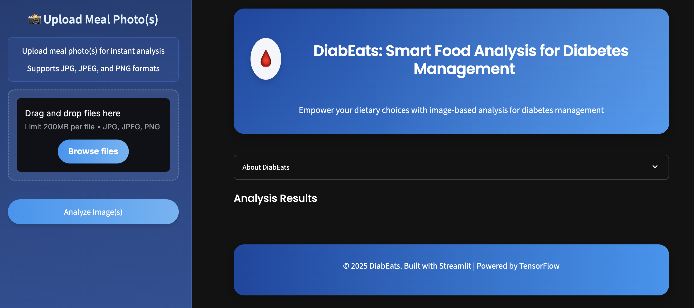

# DiabEats: Smart Food Analysis for Diabetes Management

## 🔍 Introduction

### Background
DiabEats addresses a significant and growing global health challenge. According to the International Diabetes Federation, over 537 million adults had diabetes in 2021, and this number is projected to rise to 783 million by 2045. This underscores the urgent need for accessible tools like DiabEats that empower individuals to manage their diabetes through informed food choices.

#### Diabetes Statistics in the United States
The number of adults (20–79 years) with diabetes in the United States has been steadily increasing:

| **Year** | **Diabetes Population (Millions)** |
|----------|------------------------------------|
| 2000     | 15.3                               |
| 2011     | 23.7                               |
| 2024     | 38.5                               |
| 2050     | 43.0 (projected)                   |

The USA, part of the IDF North America and Caribbean Region, ranks third globally for the number of adults with diabetes (20-79 years) and holds the highest total diabetes-related health expenditure.

### Problem
DiabEats focuses on a key question: **Can we provide diabetes-friendly dietary recommendations for U.S. diabetic and prediabetic users using just a photo of their meal?** This approach aims to make nutritional guidance accessible and practical for daily use.

### Target Audience
DiabEats targets individuals in the US with diabetes or prediabetes who need ongoing support in making appropriate dietary choices to manage their condition.

## 📊 Overview

DiabEats is a machine learning system designed to help individuals with diabetes and prediabetes make informed dietary choices by analyzing meal photos. The system follows a streamlined process: users upload an image of their meal through the interface, which is classified into one of 101 food classes using EfficientNetV2. Comprehensive nutrient data is retrieved for the identified food, and a rule-based assessment evaluates its impact on blood sugar for diabetes management, grounded in American Diabetes Association guidelines. Results are presented in an intuitive display with nutritional information, diabetes-relevant insights, and actionable recommendations. This process transforms a food image into actionable health insights in seconds, empowering users to manage their diabetes effectively.

The system leverages transfer learning with a pre-trained EfficientNetV2B3 model, fine-tuned on the Food-101 dataset, achieving a top-1 accuracy of 80.5% and top-5 accuracy of 94.6%. Nutritional data, sourced from Edamam API and USDA FoodData Central, is normalized to per 100g to inform impact scores. Recommendations suggest safe portion sizes or alternatives based on impact levels, presented in structured Markdown tables for clarity.

## 🚀 Features

- **Food Image Recognition**: Upload food images for analysis using a deep learning model (EfficientNetV2).
- **Nutritional Analysis**: Retrieve detailed nutritional information for identified foods.
- **Diabetes Impact Assessment**: Get personalized impact assessment using a rule-based approach based on nutritional profiles.
- **Smart Recommendations**: Receive tailored dietary recommendations based on impact level.
- **Interactive Dashboard**: User-friendly interface with visualizations and detailed analytics.
- **Multi-food Analysis**: Analyze multiple food items simultaneously with portion size adjustments.

## 🔧 Technical Architecture

# Diabetes Meal Analysis System Architecture

The system is proposed to follow a workflow as illustrated in the diagram below. The architecture consists of several key components:


1. **Upload Meal Image**:
   - User Interface provides an intuitive platform for meal image uploads
   - Image Processing module handles standardization of uploaded images
   - The system accepts various image formats and qualities to maximize accessibility

2. **Identify the Meal Image**:
   - **EfficientNetV2** model analyzes the image with high accuracy
   - The Food-101 Dataset forms the foundation for the image recognition training
   - Advanced image preprocessing enhances features for better recognition

3. **Retrieve Nutrition Data**:
   - Food Recognition Model connects image analysis results to the nutrition database
   - Nutrition API interfaces with external sources for comprehensive nutritional information
   - The system extracts detailed macro and micronutrient profiles for identified foods

4. **Evaluate Diabetes Impact**:
   - Rule-Based Assessment evaluates nutritional features for diabetes impact
   - Impact Classification module combines nutritional data with glycemic responses
   - The system considers carbohydrate content, glycemic index, and portion sizes

5. **Offer Diet Recommendations**:
   - Recommendation engine generates personalized dietary advice
   - Alternative food suggestions are provided based on nutritional profiles
   - Portion adjustments are calculated to optimize blood sugar management

6. **Display Analysis Results**:
   - Impact Assessment engine processes outputs into meaningful impact categories
   - User Interface renders comprehensive results with visual aids
   - The system provides educational content about nutritional choices

This architecture enables seamless flow from image input to personalized dietary recommendations, with each component optimized for its specific function while maintaining efficient integration with other modules.


## 📂 Project Structure

```
DiabEats/
├── code/
│   ├── 00_download_food101_dataset.ipynb
│   ├── 01_prepare_food101_dataset.ipynb
│   ├── 02_food_recognition.ipynb
│   ├── 03_food101_nutrition_database.ipynb
│   └── 04_diabetes_management_classification.ipynb
├── data/
│   ├── food101/
│   │   ├── food-101/
│   │   │   ├── images/
│   │   │   └── meta/
│   │   ├── license_agreement.txt
│   │   ├── README.txt
│   │   └── class_names.json
│   ├── food101_nutrition_database.csv
│   └── images/
├── models/
│   ├── food_classes.json
│   ├── food_recognition_model.keras
├── static/
│   └── style.css
├── images/
│   ├── app_landing_page.png
│   ├── data_batch_preview.png
│   ├── risk_level_distribution.png
│   └── training_history.png
├── app.py
├── LICENSE
├── README.md
└── requirements.txt
```

## 📱 Application Overview



The `app.py` file powers a Streamlit web application that seamlessly integrates all components of DiabEats, providing an intuitive and interactive experience. Built with Streamlit, the app features a responsive, dark-mode-compatible UI designed for individuals with diabetes, caregivers, and healthcare professionals.

### Key Features of the Streamlit Application

- **Image Upload Interface**: A sidebar file uploader allows users to upload single or multiple food images (JPEG or PNG) and set custom portion sizes for each item.
- **Real-Time Analysis**: Upon clicking "Analyze Image(s)," the app identifies foods using EfficientNetV2, retrieves nutritional data, and applies the rule-based assessment to classify diabetes impact levels (Low, Moderate, High).
- **Comprehensive Results Display**: Results include top 5 predictions with confidence levels, detailed nutritional breakdowns, impact assessments, and combined analysis for multiple foods, presented in structured Markdown tables.
- **Interactive Visualizations**: Bar plots show prediction probabilities, and tables provide nutritional insights, all styled for clarity and accessibility.
- **Multi-Food Support**: For multiple images, results are separated with colored dividers, enhancing readability.
- **User-Friendly Design**: Expandable sections, tooltips, and a clean layout ensure ease of use for all users.

This comprehensive approach empowers individuals with diabetes to make informed dietary choices on the go.

## 📚 Data Sources

- **Food-101 Dataset**: A large dataset containing 101,000 food images across 101 food categories.
- **Edamam Food Database API**: Additional nutritional data source.
- **USDA FoodData Central**: Comprehensive food composition database.

## 📋 Data Dictionary

### Food-101 Nutrition Database

This data dictionary refers to [food101_nutrition_database.csv](./data/food101_nutrition_database.csv), which can be found in the [data](./data/) folder of this repository.

| Column | Description | Data Type | Example |
|--------|-------------|-----------|---------|
| label | Food category name | string | "apple_pie" |
| weight | Portion weight in grams | integer | 100 |
| calories | Energy content in kcal | float | 300 |
| protein | Protein content in grams | float | 3 |
| carbohydrates | Carbohydrate content in grams | float | 45 |
| fats | Fat content in grams | float | 12 |
| fiber | Dietary fiber in grams | float | 2 |
| sugars | Sugar content in grams | float | 20 |
| sodium | Sodium content in milligrams | float | 150 |

### Food-101 Dataset

The [Food-101](./data/food101) dataset contains [101](./data/food101/food-101/images/) food categories with 1,000 images per category, totaling 101,000 images. All images are rescaled to have a maximum side length of 512 pixels.

| Food Categories (Sample) |
|-------------------------|
| apple_pie |
| baby_back_ribs |
| baklava |
| beef_carpaccio |
| beef_tartare |
| ... |
| waffles |
| watermelon |
| wine_glass |

## 📓 Notebook Descriptions

### [00_download_food101_dataset.ipynb](./code/00_download_food101_dataset.ipynb)
This notebook downloads the Food-101 dataset from ETH Zurich and organizes it for use in the DiabEats project.

### [01_prepare_food101_dataset.ipynb](./code/01_prepare_food101_dataset.ipynb)
This notebook processes the Food-101 dataset, organizing it into train, validation, and test directories for training the food recognition model.

### [02_food101_nutrition_database.ipynb](./code/02_food101_nutrition_database.ipynb)
This notebook extracts nutritional information for the food categories in the Food-101 dataset using the Edamam Food Database API and performs a basic assessment of their suitability for individuals with diabetes. The results are saved to a CSV file.

### [03_food_recognition.ipynb](./code/03_food_recognition.ipynb)
This notebook trains a food recognition model using EfficientNetV2B3 on the Food-101 dataset, with enhanced data augmentation, mixed precision training, and progressive fine-tuning for the DiabEats project.

### [04_diabetes_management_classification.ipynb](./code/04_diabetes_management_classification.ipynb)
This notebook develops a rule-based system to classify foods as Low, Moderate, or High impact on glycemic control for diabetes management based on their nutritional profiles. The system supports both single and multiple food items, integrates image-based food recognition, and provides structured dietary recommendations in Markdown tables. The assessment is grounded in clinical guidelines and applied to a nutritional dataset, mimicking advanced meal analysis output formats.

## 📊 Model Performance

### CNN Model Performance (EfficientNetV2B3)

The EfficientNetV2B3 model was fine-tuned on the Food-101 dataset to achieve high accuracy in food image classification, with a top-1 accuracy of 80.5% and a top-5 accuracy of 94.6%. The training process employed transfer learning and progressive fine-tuning techniques to optimize performance.

#### Final Training Results

| Metric | Training | Validation |
|--------|----------|------------|
| Accuracy | 0.7269 | 0.8050 |
| AUC | 0.9810 | 0.9842 |
| Categorical Accuracy | 0.7269 | 0.8050 |
| F1 Score | 0.7239 | 0.8038 |
| Loss | 1.0131 | 0.7351 |
| Precision | 0.8627 | 0.8824 |
| Recall | 0.6327 | 0.7603 |
| Top-3 Accuracy | 0.8726 | 0.9155 |
| Top-5 Accuracy | 0.9160 | 0.9456 |
| Learning Rate | 1.0000e-04 | 1.0000e-04 |

The model demonstrates strong performance, with a validation top-1 accuracy of 80.5% and top-5 accuracy of 94.6%, making it highly effective for food recognition tasks. The high AUC value (0.984) indicates excellent discrimination capability between food classes.

### Training History


The training history graph illustrates the model's learning progression over epochs, showing consistent improvement in accuracy and reduction in loss. The convergence of training and validation metrics indicates good generalization without overfitting.

## 🔍 Impact Assessment Model

The application uses a two-stage approach for impact assessment:

1. **Image Classification**: EfficientNetV2 model to identify food class.
2. **Impact Analysis**: Rule-based assessment to determine diabetes impact level based on nutritional profile, aligned with clinical guidelines.

Impact levels are categorized as:
- **Low**: Safe for regular consumption.
- **Moderate**: Consume in smaller portions.
- **High**: Avoid or consume rarely in very small portions.

## 🛠️ Installation & Setup

1. Clone the repository
```bash
git clone https://github.com/yourusername/DIABETESMEALANALYSISCNNETS.git
cd DIABETESMEALANALYSISCNNETS
```

2. Install dependencies
```bash
pip install -r requirements.txt
```

3. Run the application
```bash
streamlit run app.py
```

## 🖥️ Usage

1. Access the application through your web browser (default: http://localhost:8501).
2. Upload one or more food images using the file uploader in the sidebar.
3. Specify portion sizes for each uploaded image.
4. Click "Analyze Image(s)" to process the data.
5. View the analysis results, nutritional information, impact assessment, and recommendations.

## 🔮 Conclusions & Recommendations

### Conclusions

1. The food recognition model, powered by EfficientNetV2, achieves a high top-5 accuracy of 94.6%, ensuring reliable food identification even in cases where the top-1 prediction may not be correct.
2. The rule-based diabetes impact assessment identifies carbohydrates and sugars as key factors influencing blood glucose levels, aligning with nutritional guidelines and providing actionable insights for diabetes management.
3. The system successfully meets its objectives, with the food recognition model achieving 80.5% top-1 accuracy and the rule-based assessment delivering consistent, evidence-based classifications for Low, Moderate, and High diabetes impact categories.
4. The Streamlit-based user interface provides an intuitive and interactive experience, enabling users to easily upload meal photos, view nutritional breakdowns, and access personalized recommendations.
5. The integration of portion size adjustments in the diabetes impact assessment enhances personalization, allowing the system to reflect real-world eating habits accurately.

### Next Steps

1. Expand the nutritional database beyond the current 101 food categories to include a broader range of regional and ethnic food varieties, enhancing the system’s applicability to diverse diets.
2. Refine the rule-based diabetes impact assessment by incorporating additional nutritional factors (e.g., glycemic index).
3. Optimize the EfficientNetV2B3 model to increase top-1 accuracy beyond 80.5%, potentially through advanced data augmentation techniques or further fine-tuning.
4. Implement a user feedback mechanism to allow users to correct misclassifications, improving the system’s accuracy and personalization over time.
5. Enhance the user interface with features like downloadable reports or meal tracking history to support long-term diabetes management and user engagement.
6. Integrate real-time nutritional data APIs (e.g., Edamam or USDA FoodData Central) to provide more accurate and up-to-date nutritional profiles for identified foods.

## 📜 License

This project is licensed under the MIT License - see the [LICENSE](LICENSE) file for details.

## 🙏 Acknowledgements

- The Food-101 dataset creators for providing a comprehensive food image dataset.
- Edamam and USDA for nutritional data resources.
- The TensorFlow and Streamlit communities for excellent tools and documentation.

## 👥 Contributors

- [Kibur](https://github.com/Lisanwud)

## 📧 Contact

For questions or feedback, please reach out to [kibur.lisanu@gmail.com](mailto:kibur.lisanu@gmail)

## 📚 References 

1. [Senior woman with medical problems](https://www.freepik.com/free-photo/senior-woman-with-medical-problems_7794978.htm/?utm_source=slidesgo_template&utm_medium=referral-link&utm_campaign=sg_resources&utm_content=freepik)
2. [Smiley covid recovery center female doctor checking elder patient's blood pressure](https://www.freepik.com/free-photo/smiley-covid-recovery-center-female-doctor-checking-elder-patient-s-blood-pressure_12367946.htm/?utm_source=slidesgo_template&utm_medium=referral-link&utm_campaign=sg_resources&utm_content=freepik)
3. [Doctor using tensiometer high angle](https://www.freepik.com/free-photo/doctor-using-tensiometer-high-angle_34728752.htm/?utm_source=slidesgo_template&utm_medium=referral-link&utm_campaign=sg_resources&utm_content=freepik)
4. [International Diabetes Federation](https://diabetesatlas.org/data-by-location/country/united-states-of-america/)
5. [Mermaid](https://www.mermaidchart.com/)
6. [The Food-101 Data Set](http://data.vision.ee.ethz.ch/cvl/food-101.tar.gz)
7. [FoodData Central](https://fdc.nal.usda.gov/api-key-signup)
8. [Edamam Food Database](https://api.edamam.com/api/food-database/v2/parser)
9. [Global Diabetes Trends and Burden (PMC10591058)](https://pmc.ncbi.nlm.nih.gov/articles/PMC10591058/)
10. [AI-Based Diabetes Risk Classification System (IRJMETS)](https://www.irjmets.com/uploadedfiles/paper/issue_6_june_2022/26348/final/fin_irjmets1655889335.pdf)
11. [Machine Learning for Diabetes Risk Assessment (Frontiers in Applied Mathematics and Statistics)](https://www.frontiersin.org/journals/applied-mathematics-and-statistics/articles/10.3389/fams.2025.1490104/abstract)
12. [Self-Reported Dietary Assessment Limitations (JAMA Internal Medicine)](https://jamanetwork.com/journals/jamainternalmedicine/fullarticle/2757497)
13. [Automated Food Image Analysis for Health (PLOS Digital Health)](https://journals.plos.org/digitalhealth/article?id=10.1371%2Fjournal.pdig.0000530)
14. [Food Image Recognition Using Deep Learning (Nature Scientific Reports)](https://www.nature.com/articles/s41598-021-95341-8)
15. [AI in Diabetes Risk Prediction (npj Digital Medicine)](https://www.nature.com/articles/s41746-023-00933-5)
16. [Rule-Based Recommendation Systems for Diabetes (SAGE Open Medicine)](https://journals.sagepub.com/doi/10.1177/23333928241275292?icid=int.sj-full-text.similar-articles.3)